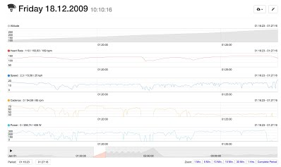
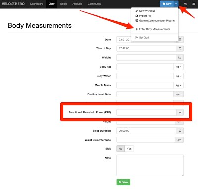

# Analysing Power Data

## Disclaimer

!!! attention
    BikeScore is a trademark of PhysFarm Training Systems LLC.
    Training Stress Score (TSS), Intensity Factor (IF) and Normalized Power (NP) are trademarks claimed by PeaksWare LLC (http://home.trainingpeaks.com/).
    Velo Hero does not calculate IF, NP, TSS, xPower, BikeScore or any other products of PeaksWare LLC or PhysFarm Training Systems LLC. Velo Hero calculates other values.

This text contains excerpts from the website of GoldenCheetah. GoldenCheetah is great software. You should try it once. From GoldenCheetah you can also upload your data to Velo Hero.

## Average, xPower, NP and Smoothed Power

When you are using a power meter you notice that power tends to move around a lot more than your heart rate.

When you stop pedalling power drops to zero immediately. Your heart rate may take 30 seconds or so to recover.

In truth, although the power meter says zero watts when you stop, the body's physiological response continues for roughly 30 seconds, as HR drops, breathing recovers and more complex energy system processes continue.

This means that if we want to use power output as a measure of training stress we will also need to translate those simplistic power readings into something that reflects the associated physiological processes and their half-lives.

This is what Dr. Andrew Coggan's Normalised Power, Dr. Phil Skiba's xPower and Velo Hero's Smoothed Power are doing; they "smooth out" the power data to reflect the underlying physiological processes.

The underlying mathematics is slightly different. However, all formulas are much more accurately than just taking a simple average.

## Intensity and Velo Hero Level

Smoothed Power is a better measure of training intensity than average power, it does not take into account differences in fitness within or between individuals. By the time you become better, stronger and faster. This should be reflected.

To account for this we need some kind of level that takes into account how hard the ride is based upon our current capability. At Velo Hero this is called Velo Hero Level. 

The Velo Hero Level is simply the ratio of the Smoothed Power as described above to your Functional Threshold Power (FTP) 

Enter your FTP under "Body measurements" <https://app.velohero.com/body/edit/new>:

For example, if your Smoothed Power is 180 W and your FTP at the time is 210 W, then the Velo Hero Level for that workout would be 0,86.

## Stress and Velo Hero Points

But there is still a problem, we know that work at high intensities for short durations elicits a different strain to work at low intensities for longer durations and there comes a point where more pain will give little gain. With Velo Hero Points the problem is solved.

The Velo Hero Level is multiplied by the duration to get an overall stress score. At Velo Hero this is called Velo Hero Points. The more points you have collected the bigger impact it will have had and likely the more recovery we will need the day after.

## Additional Links

* YouTube: [How To Use A Power Meter To Test Your Fitness Levels](https://www.youtube.com/watch?v=zik0opabRm8)
* YouTube: [How To Calculate Your FTP (Functional Threshold Power)](https://www.youtube.com/watch?v=kfJnHsKsUSM)
* TrainingPeaks: [Normalized Power, Intensity Factor and Training Stress Score](http://home.trainingpeaks.com/blog/article/normalized-power,-intensity-factor-training-stress)
* PhysFarm: [bikescore explanation - PhysFarm Training Systems (PDF)](http://www.physfarm.com/bikescore.pdf)