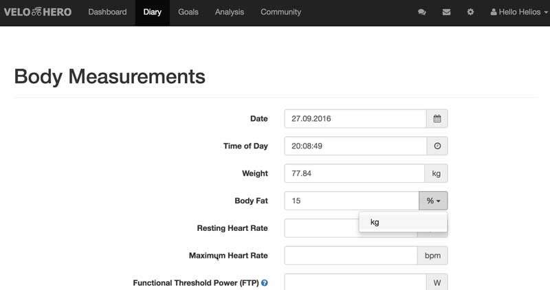
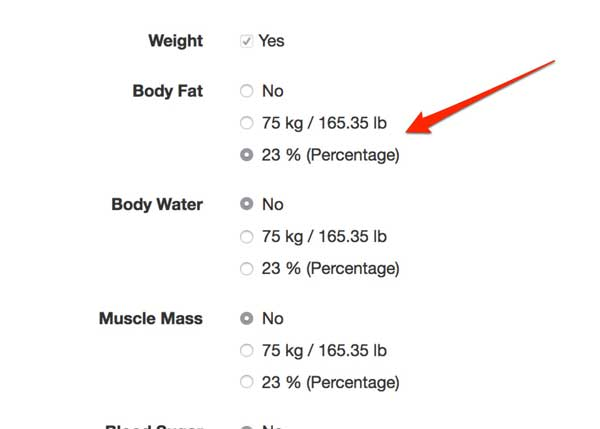

# Body Composition (Fat) Percentage

You can save body composition (fat, muscle and water) in **percent (%)** or **weight (kg, lb)**.

## Configure

You can configure the input in the [settings](https://app.velohero.com/settings/display#user_show_body_weight_unit).

