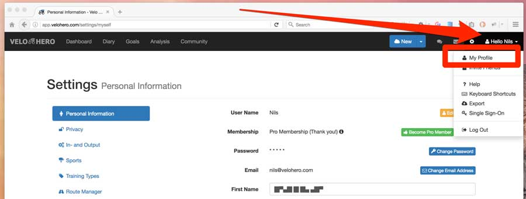
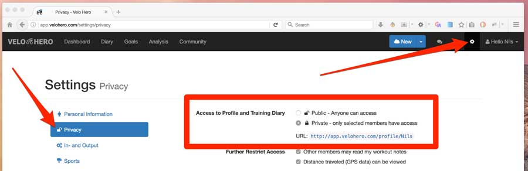
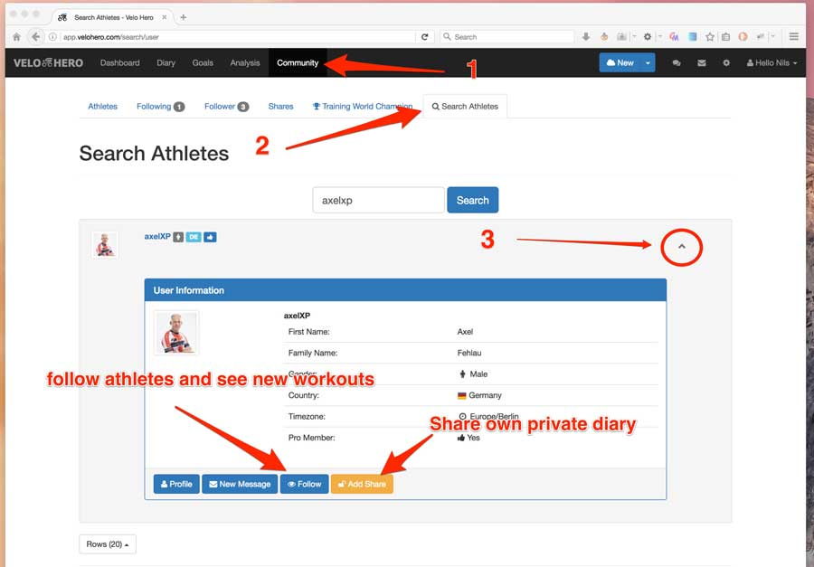
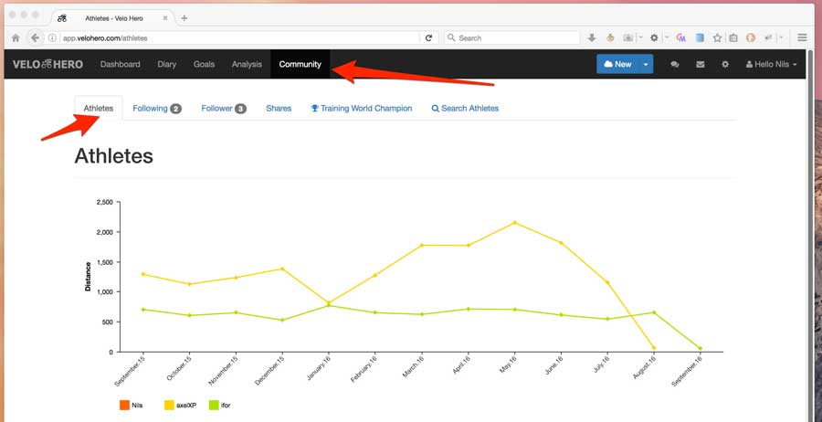
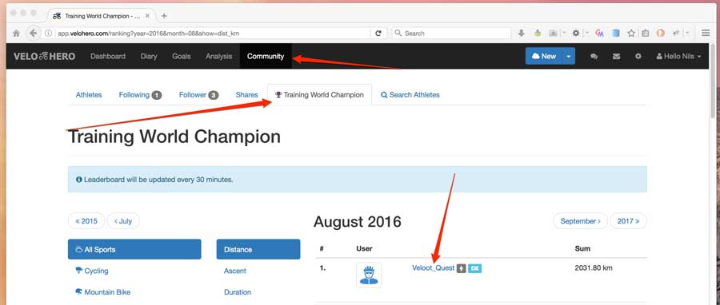
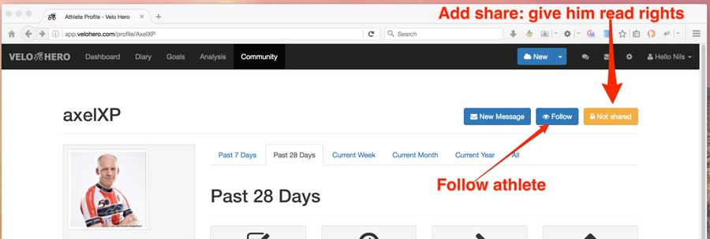

# Community Functions: Share and Follow

Velo Hero is more fun with friends. Send your friends and training partners simply an invitation. How to do this I explain here: <https://app.velohero.com/invite>

After the registration of your friends you should share your training diary with them. How this works I will explain in this article.

## Your Profile

Each Velo Hero Member has a profile. This can be Public or Private:

* **Public** profiles can be seen by all Internet users. Even people who do not have an Velo Hero account. So it's ideal to share your profile and workouts with others.
* **Private** profiles can not be viewed. You have to give other Velo Hero members an extra read rights. So it's ideal to share your profile and workouts just with a few friends or a coach.

## Privacy Settings

In the settings you can choose the general read permission.

If your profile is public you have to simply share the URL.

If it is private you can give members read permission. Therefore you have to know the user name. With the search you can find then the profile of the user.

## Add Share / Follow

You can give him read rights (Add share) and follow him.

If you follow an athlete and have read permissions (access to his profile), you see new workouts in the overview.

To start please feel free to follow a few public profiles.

By the way: You can also follow someone without to share your own profile.

If you have not disabled it in the settings, other members can send messages to you and comment on your training. This is fun and motivates.

## RSS Feed

One last Expert Tip: There is also an RSS feed with all of your workouts athletes (which you follow). The RSS feed can be found under Export <https://app.velohero.com/export>.