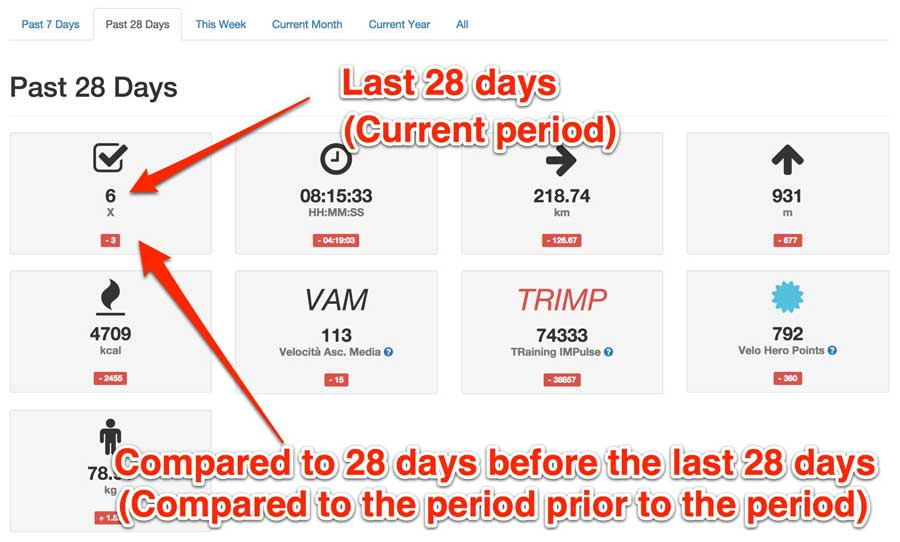
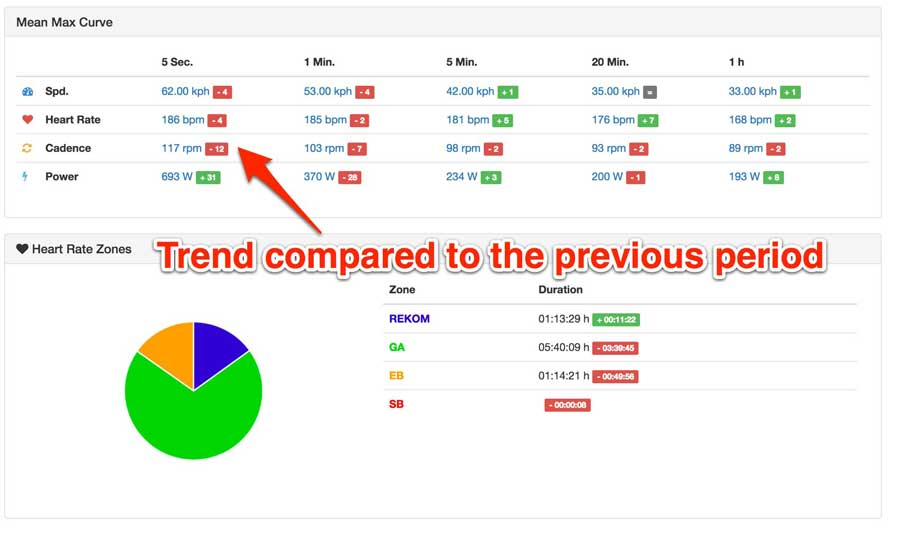

# Comparison to previous period

In the view of a period, there is a comparison with the previous period.

Here is an example with 28 days... With weeks, months and year it is exactly the same. Then it is of course the last week, last month and last year.

If today February 13, 2016 would be:

* Then the last 28 days would be the period from January 16, 2016 to February 13, 2016.
* The last 28 days before the last 28 days would be the period December 19, 2015 to January 16, 2016.

