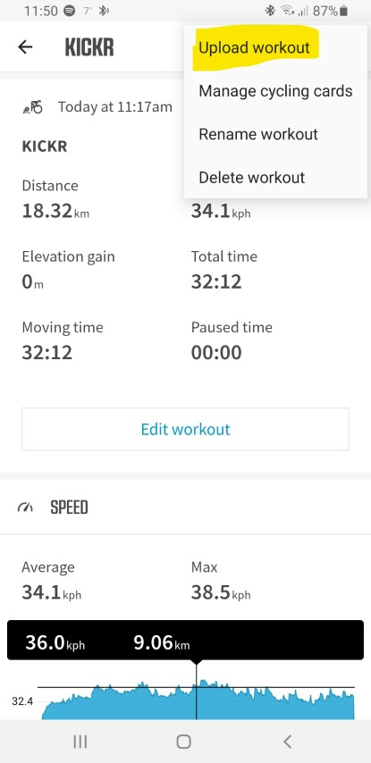
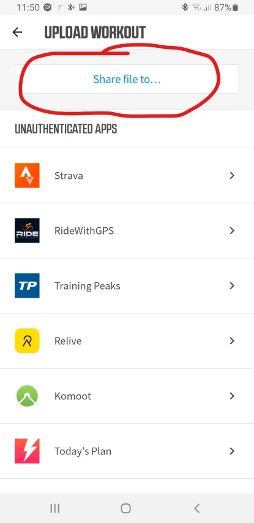
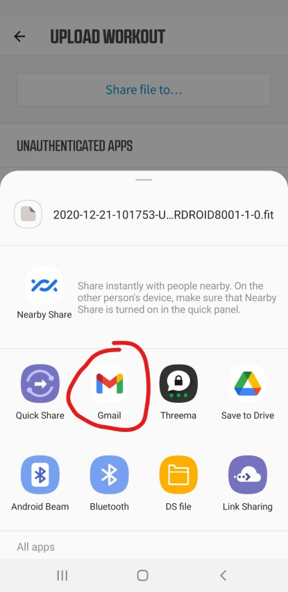

# Import Workout Files by Email

As an example the "Wahoo Fitness" app is used. With other apps it works similarly.

## Get your own email address

Goto <https://app.velohero.com/upload/email> and activate your own Velo Hero email address. Add this email address to your contacts.

## Share your workout

Tap [⋮] -> [Upload workout]:

Tap [Share file to...]

## Send

Send the FIT-file to your Velo Hero email address:

