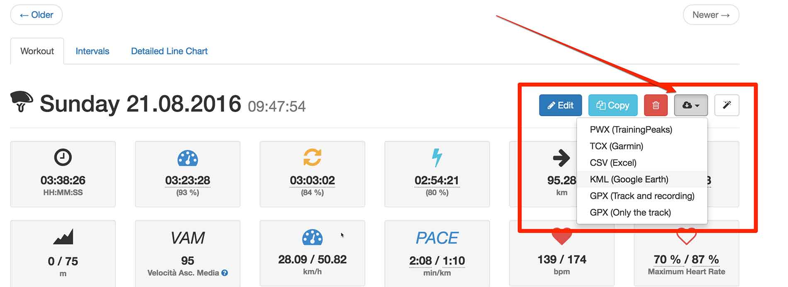
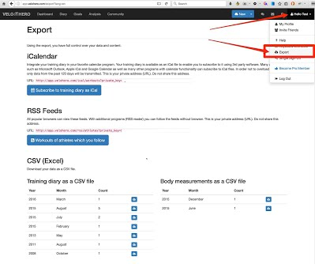

# Data Export Options (PWX, TCX, GPX, iCalendar, RSS...)

Take control of your data with our comprehensive export features.

## Workout (Activity) Exports

Export individual workouts (activities) in various formats: PWX, TCX, CSV, KML, or GPX.

**Enhanced Export with `veloherodown`**

Simplify your workout exports using the open-source command-line tool, `veloherodown`. This tool allows you to easily download your recorded activities from Velo Hero and is compatible with Windows, macOS, and Linux.

Get more information and download `veloherodown` from its GitHub page: <https://github.com/Cyclenerd/veloherodown>

## Monthly Summary Exports

Export monthly summaries of your activity data.

