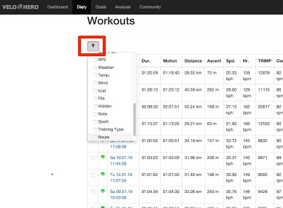
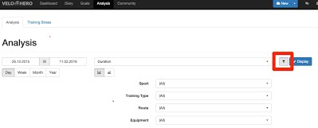
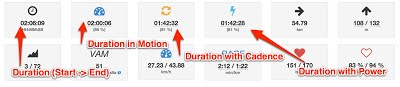
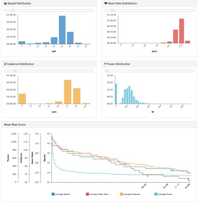
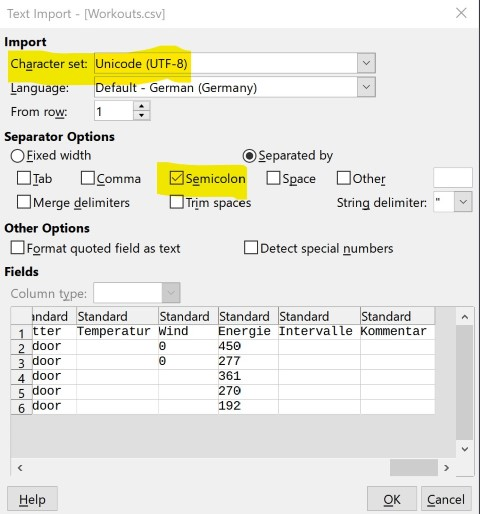
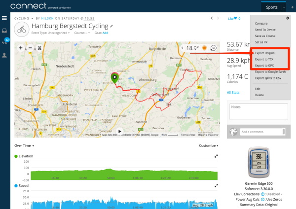

# Frequently Asked Questions

## I have forgotten my login data, what can I do?

Your Velo Hero login information can be sent to you via email. Enter your email address at the following address:

<https://app.velohero.com/recover>

You will receive an email with a link to reset your password. If you want to create a new password, please click on the link in the email.

You will then receive another email with new login information.

## What is the maximum file size for uploads?

The maximum file size is 16 megabytes (16,777,216 bytes).

The duration of one workout may not exceed 72 hours (259,200 seconds).

## How are the weeks numbers calculated?

Velo Hero calculates the weeks according to ISO.
So the weeks can differ slightly from your usual format.

Roughly summarised, this applies:

The year has max. 53 weeks.
The first week is 1 (not 0).
The first week is, depending on your setting, the week with Monday or Sunday and more than four days.

More details: <https://en.wikipedia.org/wiki/ISO_week_date>

## How can I filter workouts?

You can filter your workouts.

### Diary

### Analysis

## How do I optimize my recording?

Set the recording interval as small as possible.
If possible set the recording interval to one second.
Disable on Garmin Fitness devices the "Smart Recording" and activate "Every Second Recording".

Do not interrupt the recording and avoid gaps!
If you are doing breaks, do not stop the recording.
You're doing a workout and no walk in the park.
Every second counts.
Every second is important.
If you're doing longer breaks finish the recording and start a new recording later.
So you may see later that you have not done the distance straight.
Disable on Garmin Fitness devices the "Auto Pause".

» [See my settings from my Garmin Edge cycling computer](https://twitter.com/realCyclenerd/status/1420387338316881931)

SRM Power Control users:  Hold PRO and SET simultaneously to start a new training file before you actually start your workout.
You should really be ready to start and your Power Control should already be on your handlebars.
After your workout press MODE longer than 10 seconds to manually enter Sleep Mode and deactivate the integrated motion sensor.
Then download the training file with the SRM software.

» [See my settings from my SRM PowerControl 8 (PC8) cycling computer](https://twitter.com/realCyclenerd/status/1420390691675508739)

GPS and Smartphone users (Locus, Orux, ...):
Set the GPS accuracy to at least 20 meters.

Use if possible a speed sensor!

If you follow these tips, "duration in motion", "duration with cadence" and "duration with power" can be calculated very accurately.

NOTE: For Pro members only!

## How Velo Hero comes to its values?

Here I would like to explain a few points regarding the calculations.
Please also read how you can optimize your recording for the calculation.

First things first:
Velo Hero differs between duration and time in motion (moving time).
Time in motion is the time with power, cadence or speed.
The duration is the time between the start and the end of the recording.

If possible averages are calculated with time in motion.
But this is not always possible.
For some file types, the totals and averages are taken from the file and are not recalculated.

### FIT

* File Type: `.FIT`
* Vendors: Garmin, SRM, SIGMA, Zwift, many more
* Distance: Read
* Ascent: Calculated
* Average Speed: Calculated
* Average Heart Rate: Calculated
* Average Cadence: Calculated
* Average Power: Calculated
* Calories: Read / Calculated  (only with power)

### TCX

* File Type: `.TCX`
* Vendors: Garmin, Polar, many more
* Distance: Read
* Ascent: Calculated
* Average Speed: Read
* Average Heart Rate: Read
* Average Cadence: Read
* Average Power: Read
* Calories: Read

### GPX

Many vendors offer a GPX export.
Often there are differences in the structure of the file, so here we differentiate between the brands.

#### Garmin, Suunto, many more

* File Type: `.GPX`
* Vendors: Garmin, Suunto, many more
* Distance: Calculated (using the GPS coordinates)
* Ascent: Calculated
* Average Speed: Calculated
* Average Heart Rate: Calculated
* Average Cadence: Calculated
* Average Power: -
* Calories: -

#### Mio

* File Type: `.GPX`
* Vendors: Mio
* Distance: Read
* Ascent: Calculated
* Average Speed: Read
* Average Heart Rate: Read
* Average Cadence: Read
* Average Power: Read
* Calories: Read

#### FALK

* File Type: `.FIT`
* Vendors: Garmin, SRM, SIGMA, Zwift, many more
* Distance: Read
* Ascent: Calculated
* Average Speed: Read
* Average Heart Rate: Read
* Average Cadence: Read
* Average Power: -
* Calories: -

### HRM

* File Type: `.HRM`
* Vendors: Polar, Tacx
* Distance: Read
* Ascent: Calculated
* Average Speed: Calculated
* Average Heart Rate: Calculated
* Average Cadence: Calculated
* Average Power: Calculated
* Calories: Calculated (only with power)

### SRM

* File Type: `.SRM`
* Vendors: Schoberer Rad Messtechnik
* Distance: Read
* Ascent: Calculated
* Average Speed: Calculated
* Average Heart Rate: Calculated
* Average Cadence: Calculated
* Average Power: Calculated
* Calories: Calculated (only with power)

### SLF

* File Type: `.SLF`
* Vendors: SIGMA
* Distance: Read
* Ascent: Calculated
* Average Speed: Read
* Average Heart Rate: Read
* Average Cadence: Read
* Average Power: Read
* Calories: Read

### SMF

* File Type: `.SMF`
* Vendors: SIGMA
* Distance: Read
* Ascent: Read
* Average Speed: Read
* Average Heart Rate: Read
* Average Cadence: Read
* Average Power: Read
* Calories: Read

### PWX

* File Type: `.PWX`
* Vendors: TrainingPeaks, Timex, many more
* Distance: Read
* Ascent: Calculated
* Average Speed: Calculated
* Average Heart Rate: Calculated
* Average Cadence: Calculated
* Average Power: Calculated
* Calories: Calculated (only with power)

### CSV

* File Type: `.CSV`
* Vendors: PeriPedal
* Distance: Read
* Ascent: -
* Average Speed: Calculated
* Average Heart Rate: Calculated
* Average Cadence: Calculated
* Average Power: Calculated
* Calories: -

### EGE

* File Type: `.EGE`
* Vendors: ErgoPlanet
* Distance: Read
* Ascent: Calculated
* Average Speed: Read
* Average Heart Rate: Read
* Average Cadence: Read
* Average Power: Read
* Calories: Read

### EMC2

* File Type: `.EMC2`
* Vendors: daum electronic
* Distance: Read
* Ascent: -
* Average Speed: Calculated (using duration)
* Average Heart Rate: Calculated
* Average Cadence: Calculated
* Average Power: Calculated
* Calories: Read

An attempt is made to calculate the  Average Speed using the speed between the records points and time in motion. It is not distance divided by time.

Average power is calculated with time in motion. You therefore often get higher values than in other analyses. You get with this calculating a value that is similar to a race. Also, you can also better compare workouts with different pauses (traffic signals). Many other programs calculate average power with the duration.

Average cadence is calculated without zeros.

An extra explanation for the calculation of altitude can be found below.

## How do you calculate the altitude?

All elevation data are filtered with a threshold of 3 meters.
This means that only changes over 3 meters are considered for the calculation of the altitude.

So you see a different value as on your device.
You can better compare different recording from different devices with this calculation.

## Is there an API for developers?

Yes :-)

Send me an e-mail. I'll help you.

## How do I import the CSV export into LibreOffice?

Pease read: <https://help.libreoffice.org/Calc/Importing_and_Exporting_CSV_Files>

Specify the options to divide the text in the file into columns only with Semicolon.

## Why is speed and altitude missing in Garmin Connect Export?

Since March 8, 2015 no velocity data and elevation data are included in the Garmin Connect export (TCX- and GPX-file).
Why Garmin does not output the existing values, I can not say.

To ensure that no detail is lost, the original file must be imported.
This is the only way to ensure that the recorded values can be read correctly!

Discussion in Garmin forum:

* <https://forums.garmin.com/showthread.php?220362-Export-to-TCX-Where-s-the-Elevation-Data>
* <https://forums.garmin.com/showthread.php?234572-evevation-missing-from-gpx-file-exported-from-Connect>
* <https://forums.garmin.com/showthread.php?229674-Exporting-data-to-tcx-or-gpx-NO-elevation-data>

## Where can I find my Garmin FIT/TCX files?

Connect your Garmin Edge via USB to your computer.
Your Garmin device shows up as USB drive.
Open the folder `Garmin\Activities`.
You will find FIT or TCX-files. Upload this files to [Velo Hero](https//app.velohero.com/upload).

## Where can I find my SRM files?

* Windows 95, 98, 2000 and Windows XP: `C:\Program Files\SRM Training System\_DATA.SRM`
* Windows Vista, Windows 7 and Windows 8: `C:\Users\Public\Documents\SRM\_DATA.SRM`
* macOS: `Macintosh HD/Users/Shared/SRM/SRMFILES`

## Where can I find my TCX files from Garmin ANT Agent?

* Windows 2000 and Windows XP: `C:\Documents and Settings\<USERNAME>\Application Data\GARMIN\Devices\<DEVICE-ID>`
* Windows Vista, Windows 7 and Windows 8: `C:\Users\<USERNAME>\AppData\Roaming\GARMIN\Devices\<DEVICE-ID>`
* macOS: `Macintosh HD/Users/<USERNAME>/Library/Application Support/Garmin/Devices/<DEVICE-ID>`

On Windows computers, the Application Data (AppData) folders are hidden by default and you must enable the display of hidden files before you are able to see these elements.
Please see: <http://windows.microsoft.com/en-us/windows/show-hidden-files#show-hidden-files=windows-7>

## Where does Garmin Express store my workouts?

If synchronization with Garmin Connect is not done (for example, because the site is not reachable), you'll find your workout files here:

On Mac: `~/Library/Application Support/Garmin/GarminConnect/UnitID/Upload`

All you need to do is hit Command + Shift + G from the Mac desktop (or Finder > Go > Go to Folder) and type in "~/Library/Application Support/Garmin/GarminConnect" to temporarily access the Library directory in the Finder.

On Windows 7, 8, ...: `C:\ProgramData\Garmin\GarminConnect\DeviceUnitID\Upload`

On Windows, you may need to select the "Show hidden and system folders" option.
On Windows computers, the ProgramData folder is hidden by default and you must enable the display of hidden files before you are able to see these elements.
Please see: <http://windows.microsoft.com/en-us/windows/show-hidden-files#show-hidden-files=windows-7>

In each of these folders you'll find your workouts listed as `.FIT` files.

## Why my profile picture (Gravatar) is not displayed?

If your profile picture is not displayed, check the following step:

* Make sure that the same e-mail address is used at Gravatar.com and Velo Hero.
* The image must be classified as G (suitable for display on all websites with any audience type)
* Save your personal information settings again at Velo Hero (<https://app.velohero.com/settings/myself>)

## Why no heart rate or power zones are displayed?

If you do not see heart rate or power zones, please check the following:
* You must have a valid Pro Membership (<https://app.velohero.com/settings/myself>)
* The workout must be assigned a sport
* The sport must have configured heart rate zones (<https://app.velohero.com/zones/heartrate>) - aware period

