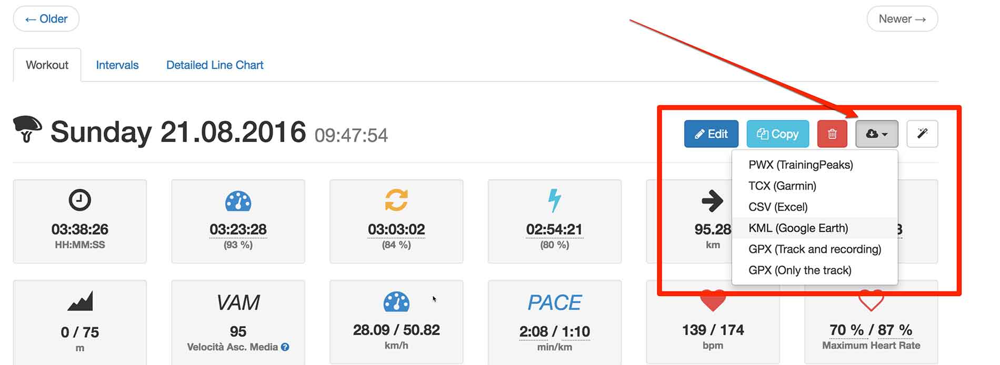
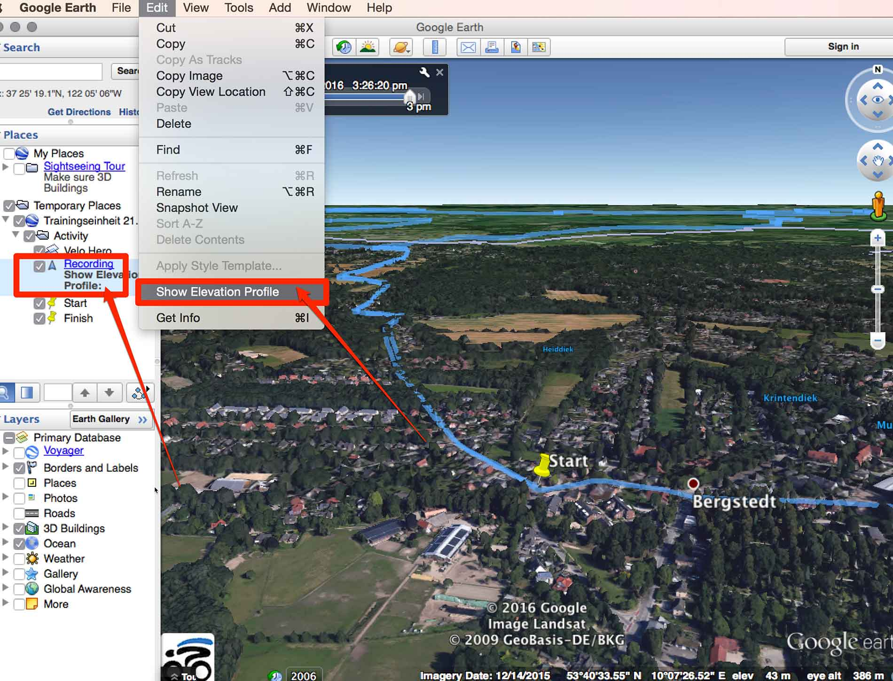
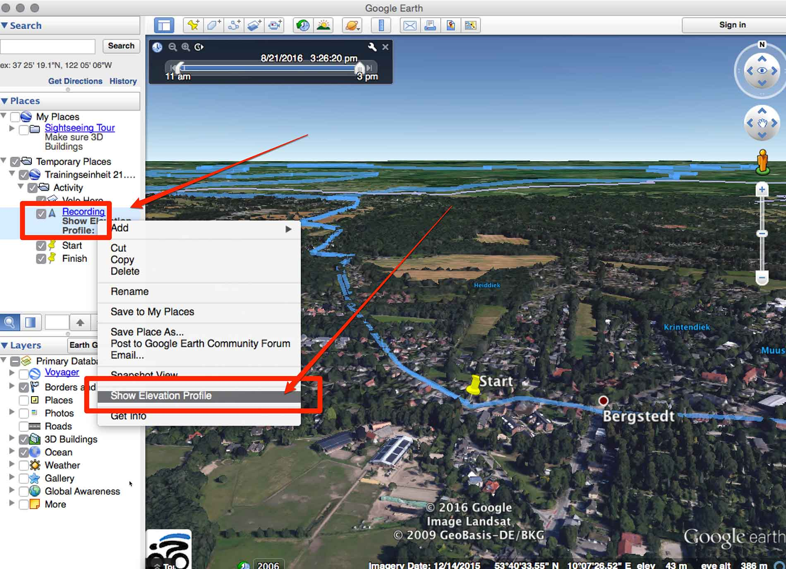

# Google Earth Export

1.) Download `.KML` file

2.) Open .KML file with Google Earth

3.) Show Elevation Profile (<https://support.google.com/earth/answer/181393?hl=en>)

Once you've chosen the recording (workout) from the Places panel, there are two ways to see its Elevation profile. 

Either go to [Edit] > [Show Elevation Profile ...]

... or right-click on your recording from the Places panel and select [Show Elevation Profile].

## Video

* YouTube: [Velo Hero Google Earth Export](https://www.youtube.com/watch?v=-4HRiN6NrfU)