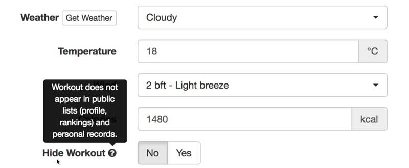
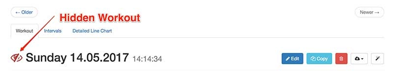

# Hide Workout

You can hide workouts. Other members (who have access to your training diary) will not see these activities.

Hide Workout:

Hidden Workout:

If you synchronize your data via Tapiriik, Velo Hero tries to accept this setting (for example, from Garmin Connect).
