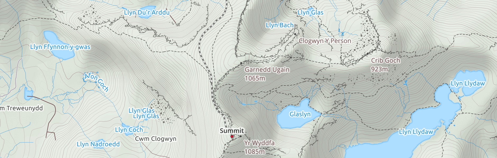
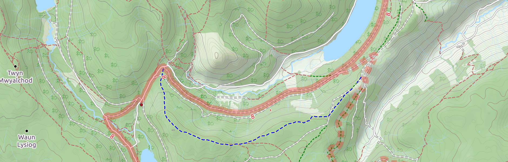
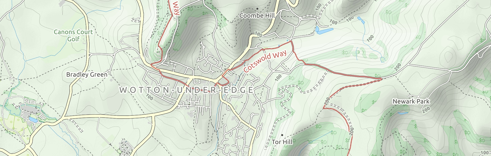
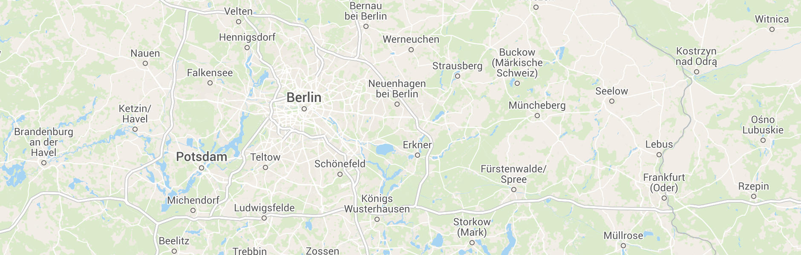
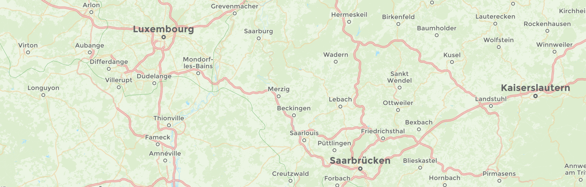
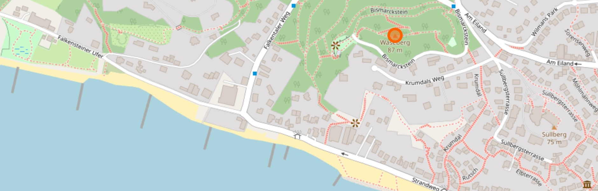
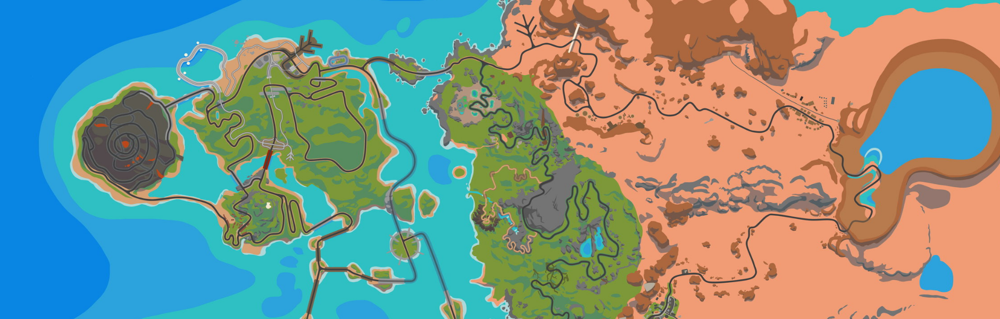

# Maps

You can choose between several map styles.

You can temporarily choose a different map style by clicking on the upper right icon in the map view or set a default style in the [settings](https://app.velohero.com/settings/display).

## Landscape (Default)

> The world is full of interesting features beyond roads and houses.
> The landscape layer emphasises natural features and is a perfect display for those interested in nature, the countryside, and life beyond the city.

* 🗺️ Maps: [Thunderforest](https://www.thunderforest.com/)
* 🗃️ Data: [OpenStreetMap contributors](https://www.openstreetmap.org/copyright)

## OpenCycleMap

> OpenCycleMap is the award-winning world-wide map for cyclists.

* 🗺️ Maps: [Thunderforest](https://www.thunderforest.com/)
* 🗃️ Data: [OpenStreetMap contributors](https://www.openstreetmap.org/copyright)

## Outdoors

> Aimed at the outdoors enthusiasts, this map style displays hiking routes, ski runs and many useful points of interest.

* 🗺️ Map: [Thunderforest](https://www.thunderforest.com/)
* 🗃️ Data: [OpenStreetMap contributors](https://www.openstreetmap.org/copyright)

## Atlas

> A clear map style for both navigation and local context.

* 🗺️ Map: [Thunderforest](https://www.thunderforest.com/)
* 🗃️ Data: [OpenStreetMap contributors](https://www.openstreetmap.org/copyright)

## Neighbourhood

> All the worlds neighbourhoods on a clean map style.

* 🗺️ Map: [Thunderforest](https://www.thunderforest.com/)
* 🗃️ Data: [OpenStreetMap contributors](https://www.openstreetmap.org/copyright)

## OpenStreetMap

> OpenStreetMap is a map of the world, created by people like you and free to use under an open license.

* 🗺️ Map: [Humanitarian OpenStreetMap Team](https://www.hotosm.org/) hosted by [OpenStreetMap France](https://www.openstreetmap.fr/)
* 🗃️ Data: [OpenStreetMap contributors](https://www.openstreetmap.org/copyright)

## Zwift

In addition to the real world maps mentioned above, Velo Hero also supports Zwift.

The Map of Watopia is automatically displayed when importing [Zwift FIT files](/help/zwift.html).

* 🗺️ Map: [Zwift](https://www.zwift.com/)
* 🗃️ Data: [Zwift Hacks](https://zwifthacks.com/)

