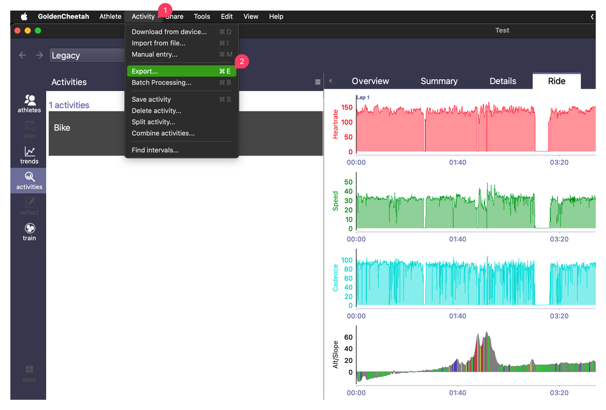
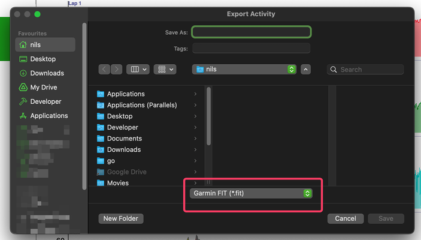

# Importing Zwift Activities

Direct FIT file imports from Zwift are currently unavailable.
Zwift changed their file format in February 2025, making direct import into Velo Hero impossible.
I am unsure when, or if, direct import functionality will be restored.

**Workaround:**
To import your Zwift training logs into Velo Hero, you'll need to use an intermediary platform.
You can either use Garmin Connect or the free, open-source software [GoldenCheetah](https://www.goldencheetah.org/).

Tip: GoldenCheetah also offers a direct synchronization feature with Velo Hero. Explore this option for a streamlined workflow.

## Using GoldenCheetah (Recommended)

[GoldenCheetah](https://www.goldencheetah.org/) is a powerful, free tool available for Windows, macOS, and Linux.
Here's how to use it to import your Zwift activities:

1. Import: Import your Zwift recording into GoldenCheetah.
1. Export: Export the activity from GoldenCheetah. Choose the Garmin FIT format. (See screenshots below)
1. Import to Velo Hero: Import the newly exported FIT file into Velo Hero.

Screenshots:

