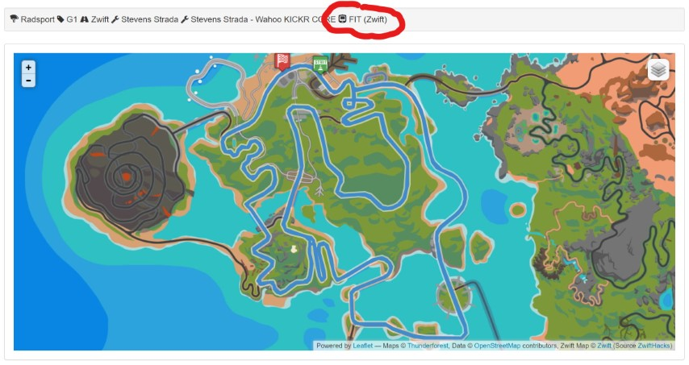
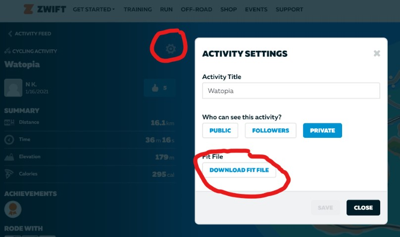

# Zwift

!!! warning "Pro Member"
    Exclusive function for Pro members! You must be a Pro member to upload training files.

I use Zwift myself. Velo Hero is therefore compatible with Zwift.

If you import an original Zwift activity recording (FIT file) from Zwift, Watopia will be shown as a map.

Important: It must be the original FIT file. Exports from third party providers do not work.

## Where can I find my Zwift FIT files?

Zwift stored your activity data with the Flexible and Interoperable Data Transfer (FIT) protocol.
FIT is designed specifically for the storing and sharing of data that originates from sport.

### Zwift Website (Dashboard)

To manually upload a Zwift ride that you successfully completed to Velo Hero,
you can download the .FIT file from your [ACTIVITY FEED](https://www.zwift.com/feed).

### Windows and macOS

Your .FIT file is automatically saved every 10 minutes in the `\Documents\Zwift\Activities` folder on your computer.

* Windows: `C:\Users\<YOUR-USERNAME>\Documents\Zwift\Activities`
* macOS: `Macintosh HD/Users/<YOUR-USERNAME>/Documents/Zwift/Activities`

### iOS

If you're riding on iOS, here’s how to reach your .FIT file:

* Starting up the Zwift Application.
* Tapping on the 'Zwift' Logo 3 times.
* This will open up a browser, allowing you to choose your file (log or .FIT) and then email them to whomever you'd like, yourself included.

Source: <https://www.zwift.com/news/4617-zwift-how-to-accessing-your-ride-data-from-anywhere>